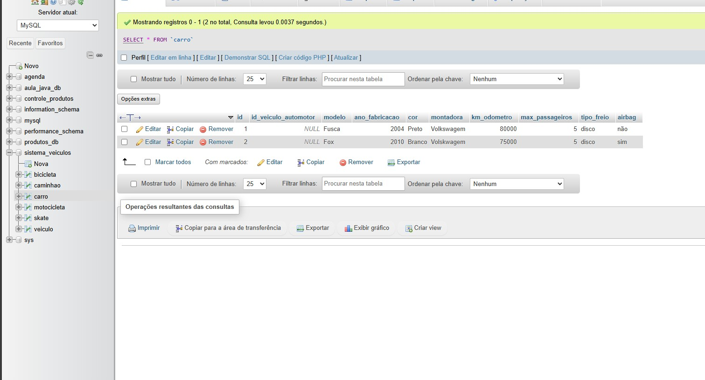

# Sistema Veículos

Esta atividade é requisito da Avaliação Final

## 🚀 Começando

*Um sistema processa dados de veículos de vários tipos. Nesse sistema, todos os automotores possuem modelo, ano de fabricação, montadora, cor, e kilometragem (odômetro). Um automóvel doméstico possui também quantidade máxima de passageiros, tipo de freio e airbag. As motocicletas possuem cilindradas e torque. Os caminhões possuem quantidade de eixos e peso bruto. As bicicletas possuem, modelo, marca, cor, material, quantidade de marchas e amortecedor. Os skates possuem modelo, marca, cor e tipo das rodas. O modelo e ano de fabricação são obrigatórios para todos os veículos.

*Todos os atributos devem ser encapsulados e validados quando necessário.

*Todas as classes devem ter seus construtores e um método que gera o comando insert desses dados. Para isso, considere o nome classe como o nome da tabela e cada atributo da classe como um campo desta tabela. Pesquisar sobre override pode ser útil.

*Crie vários objetos para testar as classes e seus métodos.

[Foto do Sistema Veículos no WAMP SERVER]

()

### 📋 Pré-requisitos

De que coisas você precisa para instalar o software e como instalá-lo?

*Java JDK.

*IDE Eclipse ou qualquer outra IDE.

*MySQL para ter um banco de dados.

*Driver JDBC para conexão com o banco de dados.

### 🔧 Instalação

Após abrir o pacote com os Arquivos para o programa executar, entre no Arquivo Main, onde estarão todas as informações de Input do programa, utilize os números de 1 a 5 para selecionar a opção desejada e siga utilizando os métodos do projeto para se ter uma lista de veiculos cadastrados no seu programa

## 🛠️ Construído com

* IDE Eclipse
* JRE System Library
* Maven Dependencies
* WAMP SERVER
* 
## 📌 Versão

* **Eclipse Installer 2024-09 R
* * Wamp Server 3.3.5

## ✒️ Autores

* **Matheus Leone** - *Trabalho Inicial* - Sistema Veículos
